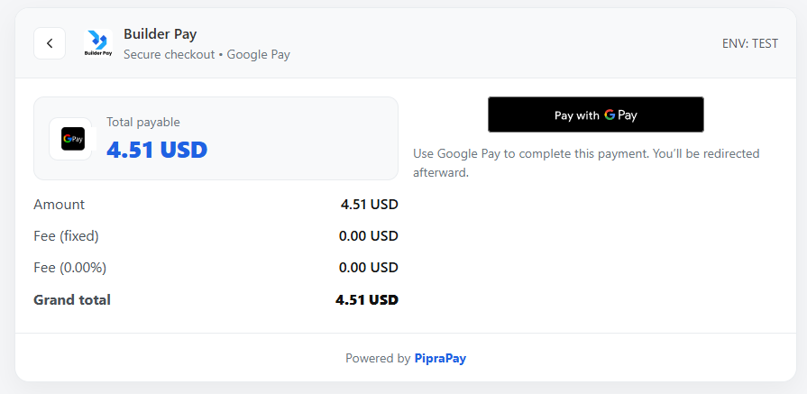
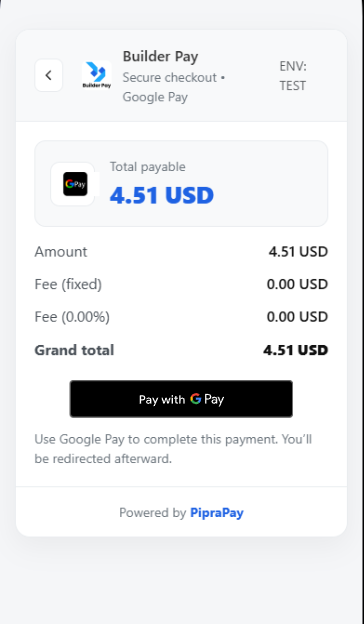

# GPay Direct Payment Gateway for PipraPay
 

Google Pay Direct is a payment gateway plugin for the [PipraPay](https://piprapay.com/) platform. It enables your customers to pay with their saved cards in Google Pay using **Direct tokenization (ECv2)**. With Direct tokenization you receive an encrypted payment token and process the card transaction yourself via your acquirer.
## Screenshot
**Desktop View**  
  
**Mobile View**  


## Features

- Accept payments from Google Pay using Direct tokenization (ECv2).
- Supports **Sandbox** and **Production** modes.
- Customizable display name, min/max amounts, fixed and percent fees.
- Merchant name and optional Merchant ID (`required in production`, `optional in test`).
- ECv2 public key configuration store your 65‑byte uncompressed P‑256 key.
- Built-in **sandbox simulator**: automatically marks transactions complete for testing.
- Server‑side ECv2 decrypt stub included; replace with your own implementation when you go live.
- Responsive checkout UI with a **Pay with GPay** button.

## Installation

1. Download the plugin from  or the provided ZIP file and place it in your PipraPay Admin panel plugin uploader or installation under `pp-content/plugins/payment-gateway`.
2. Activate **Google Pay Direct** from the PipraPay admin panel.
3. Go to **Payment Gateways → Google Pay** and configure:

| Setting                           | Description                                                      |
| --------------------------------- | ---------------------------------------------------------------- |
| **Mode**                          | `Sandbox` for testing, `Live` for real payments.                 |
| **Merchant Name**                 | The display name shown to customers.                             |
| **Merchant ID**                   | Required only in `Live` mode (omit in `Sandbox`).                |
| **ECv2 Public Key**               | Your Base64-encoded **uncompressed P-256 (65-byte)** public key. |
| **Fixed Charge / Percent Charge** | Define your fees per transaction.                                |

> **Public Key (ECv2):** Your Base64‑encoded 65‑byte uncompressed P‑256 public key (begins with `B` or `Q`). See the [Google Pay crypto guide](https://developers.google.com/pay/api/web/guides/resources/payment-data-cryptography) for key generation.
   - You can use the ECv2 test key for Sandbox
   ```sh
   BBpye2KNbF/W+JK+AGubqufCUUH8w/GyCV8O1l2mqf4VRPj5xcb48eJ1cbe/UnUblFXrvvh2Q9HBgL+CDs53Pes=
   ```
## Google Pay Requirements

- **Sandbox**: No ```merchantId``` required just a name.   
   - _(As per Google Pay [API docs](https://codelabs.developers.google.com/codelabs/gpay-web-101#0))_   
- **Production**: Both ```merchantId``` and ```merchantName``` are required.   
- **Public Key Format**: Must be Base64 encoded, 65 bytes, starts with byte 0x04 (uncompressed EC point).   
   - _(Per Payment [Data Cryptography](https://developers.google.com/pay/api/web/guides/resources/payment-data-cryptography))_

## Usage

- During checkout the customer sees a **Pay with GPay** button.  
- The plugin uses the official Google Pay Web SDK to check readiness (`isReadyToPay`) and then requests payment data (`loadPaymentData`).
- In Sandbox mode, after the customer authorizes the payment, the plugin automatically simulates authorization and marks the transaction **Completed**.
- In Live mode the plugin posts the encrypted token to your server and leaves the transaction **Pending**. You must:
  1. Use your private key to decrypt the ECv2 token and verify its signature.
  2. Submit the extracted card data and cryptogram to your acquirer for authorization.
  3. Update the transaction in PipraPay from **pending** to **completed** with the acquirer’s authorization ID.

## How It Works

1. Customer clicks “Pay with GPay” on checkout.
2. The Google Pay API returns an encrypted ECv2 token.
3. The plugin:
   - Posts token to your backend (ecv2-decrypt-stub.php).
   - In Sandbox → simulates success.
   - In Production → expects decrypted PAN + cryptogram from your server.
4. You send this data to your acquirer or payment processor for final authorization.

## ECv2 Decryption (Production)

> [!CAUTION]
> Replace the contents of ```ecv2-decrypt-stub.php``` with your actual decryption logic.   

> [!TIP]
> Follow Google’s guide: [Payment Data Cryptography for Google Pay](https://developers.google.com/pay/api/web/guides/resources/payment-data-cryptography?utm_source=chatgpt.com)

## Generating your public/private keys

Google Pay requires your ECv2 encryption key to be in **uncompressed point format**: one magic byte (`0x04`) followed by two 32‑byte integers for the X and Y coordinates【77782387575752†L600-L609】. Run the following commands with OpenSSL (replace `key.pem` with your desired filename):

```sh
# Generate a new P-256 private key
openssl ecparam -name prime256v1 -genkey -noout -out key.pem

# Convert your public key to base64 (uncompressed point format)
openssl ec -in key.pem -pubout -text -noout 2> /dev/null \
| grep "pub:" -A5 | sed 1d | xxd -r -p | base64 | tr -d '\n\r' > publicKey.txt
```

Use the contents of `publicKey.txt` as your **Public Key (ECv2)** in the plugin settings.

## Troubleshooting

| Issue                          | Possible Cause                                          |
| ------------------------------ | ------------------------------------------------------- |
| “Request Failed [OR_BIBED_06]” | Invalid ECv2 key format (SPKI instead of uncompressed). |
| Payment stays “Pending”        | No server-side decrypt or acquirer auth implemented.    |
| Button not visible             | Google Pay not available on current device/browser.     |


## License

This project is licensed under the [GPL 3.0](https://www.gnu.org/licenses/gpl-3.0.html) license.

         
